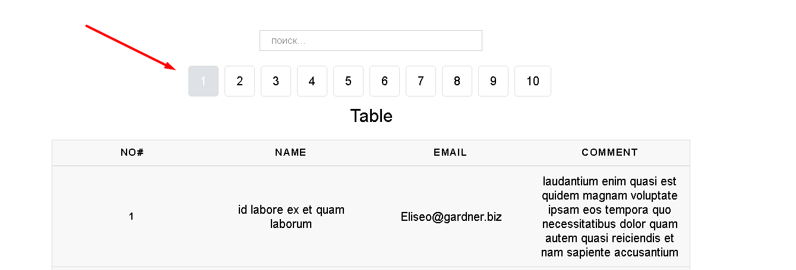

# React-list


## GH-PAGES LINK: https://yaroslavborshevsky812.github.io/react-list/

## QUICK START

```
    npm i
    npm run start
```


## DESCRIPTION
1. Use pagination buttons to switch between pages 

2. Use search bar to find specific item

3. Tap on the column name to sort by name/email/comment


